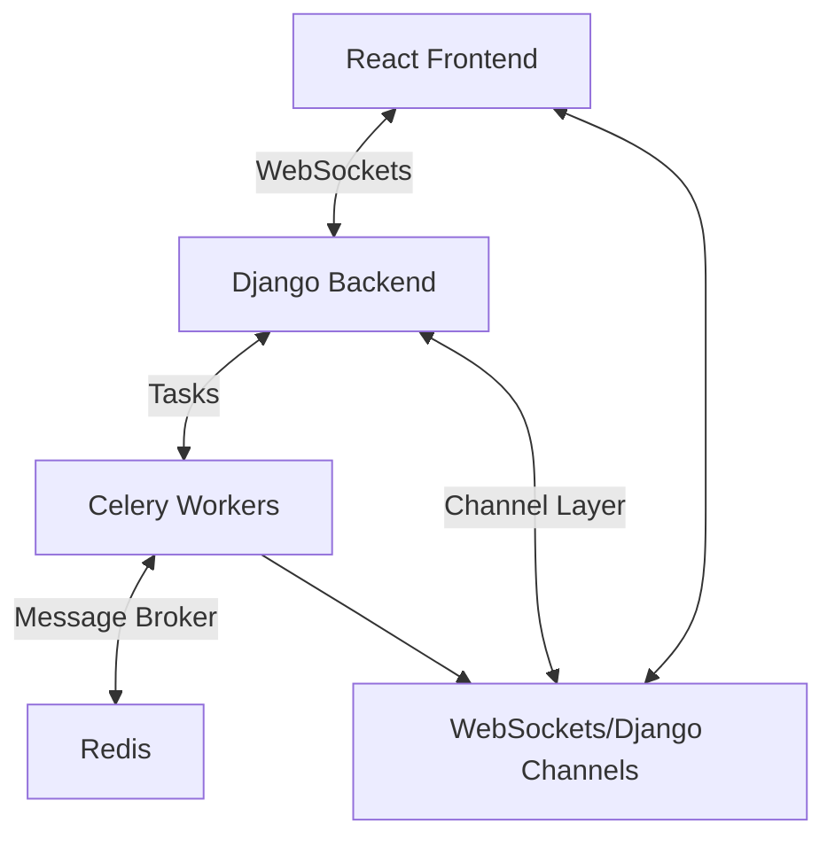
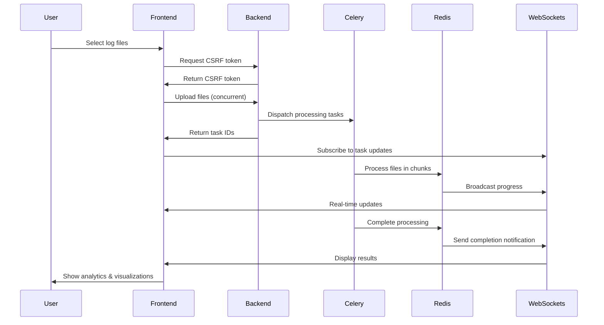
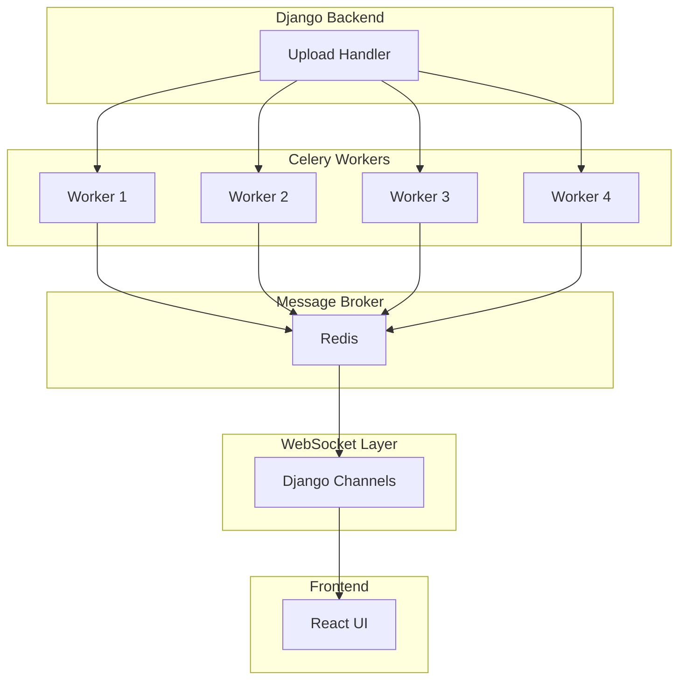
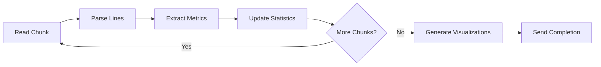
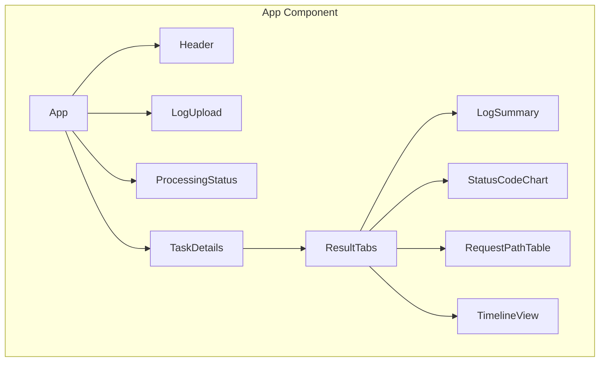

# LogMate Architecture

## System Overview

LogMate is a scalable web application for processing and analyzing log files in real-time. It provides concurrent file processing, live status updates, and generates interactive visualizations based on log content.



## Core Components

### 1. Frontend (React + Framer Motion)
The frontend user interface is built with React and enhanced with Framer Motion for fluid animations:

- **App**: Root container component that manages overall state
- **Header**: Application branding and navigation elements
- **LogUpload**: Handles drag-and-drop file uploads with smart prioritization
- **ProcessingStatus**: Real-time progress tracking with animated indicators
- **TaskDetails**: Interactive visualizations and analytics for processed logs
- **ActionButtons**: Export, download, and share functionality

### 2. Backend (Django)
The Django backend provides REST API endpoints and WebSocket connections:

- **upload_log view**: Validates, processes, and dispatches files to Celery
- **LogStatusConsumer**: WebSocket consumer for real-time bidirectional updates
- **task_status view**: Endpoint for polling task completion status
- **CSRF protection**: Secure token management for uploads

### 3. Asynchronous Processing (Celery)
Celery workers handle CPU-intensive log processing tasks:

- **process_log task**: Analyzes log files in optimized chunks
- **generate_statistics task**: Extracts patterns and metrics from logs
- **Status updates**: Sends incremental progress to connected clients

### 4. Real-time Communication (Django Channels)
Django Channels manages WebSocket connections for instant updates:

- **Group management**: Organizes clients by task ID
- **Broadcast updates**: Pushes progress notifications to relevant clients
- **Connection handling**: Manages WebSocket lifecycle events

## Data Flow



## Concurrent Processing Architecture

LogMate implements a horizontal scaling architecture for processing multiple files simultaneously:



## File Upload Process

1. User selects multiple log files through the drag-and-drop interface
2. Frontend performs initial validation and sorts files by size (smallest first)
3. Files are uploaded concurrently with progress tracking for each
4. Backend validates file type and size (up to 50MB per file)
5. Each file is assigned a unique task ID and queued for processing
6. Celery workers claim tasks based on availability and priority
7. Processing status updates are broadcast via WebSockets in real-time
8. Frontend displays progress for all files with visual indicators

## File Processing Pipeline



Each log file is processed in optimized chunks to balance memory usage and performance:

1. File is divided into 5 equal chunks for efficient processing
2. Each chunk is read and parsed line-by-line with regex pattern matching
3. Metrics are extracted and aggregated incrementally
4. Progress updates are sent after each chunk (20%, 40%, etc.)
5. Final statistics and visualizations are generated upon completion

## WebSocket Communication Protocol

The system uses a standardized message format for all WebSocket communications:

```json
{
  "type": "update",
  "task_id": "abc123",
  "status": "PROCESSING",
  "progress": 60,
  "current_chunk": 3,
  "total_chunks": 5,
  "stats": {
    "lines_processed": 12500,
    "http_methods": {"GET": 8750, "POST": 3000, "PUT": 750},
    "status_codes": {"200": 10000, "404": 1500, "500": 1000}
  }
}
```

Message types include:
- `STARTED`: Task has been claimed by a worker
- `PROCESSING`: Task is actively being processed with progress
- `COMPLETED`: Task finished successfully with full results
- `ERROR`: Task encountered an issue with error details

## Frontend Component Architecture



Components use React context for state management and custom hooks for WebSocket integration:
- `useWebSocket`: Manages connection and message handling
- `useTaskStatus`: Tracks status of multiple concurrent tasks
- `useLogAnalytics`: Processes and formats log statistics

## Log Analysis Metrics

The system extracts and visualizes the following data points:

- **Request Volume**: Total lines and requests processed
- **HTTP Methods**: Distribution of GET, POST, PUT, DELETE, etc.
- **Status Codes**: Success, client error, and server error rates
- **Popular Endpoints**: Most frequently requested paths
- **Client Information**: Top IP addresses and geographic distribution
- **User Agents**: Browser and device statistics
- **Response Times**: Average, min, max response durations
- **Error Patterns**: Common error types and frequencies
- **Traffic Patterns**: Request volume over time

## Technology Stack

### Frontend
- **Framework**: React with functional components
- **State Management**: Context API and custom hooks
- **Styling**: TailwindCSS for responsive design
- **Animations**: Framer Motion for smooth transitions
- **Visualization**: Recharts for interactive graphs

### Backend
- **Framework**: Django 4.x (ASGI mode)
- **Real-time**: Django Channels for WebSockets
- **Task Queue**: Celery for asynchronous processing
- **Message Broker**: Redis for inter-process communication
- **Server**: Daphne ASGI server

### DevOps
- **Containerization**: Docker & Docker Compose
- **Environment**: Development, staging, and production configs
- **CI/CD**: Automated testing and deployment workflow

## Scaling Considerations

### Horizontal Scaling
- Celery workers can be dynamically scaled based on demand
- Redis cluster for high-availability message brokering
- Stateless backend design enables load balancing

### Performance Optimizations
- Chunked file processing prevents memory overflow
- Priority queue ensures responsive user experience
- File size-based prioritization optimizes throughput
- WebSocket batching reduces unnecessary updates

### Future Enhancements
- Distributed file storage for handling larger logs
- Stream processing for real-time log ingestion
- Machine learning integration for anomaly detection
- Custom log format templates for specialized analysis